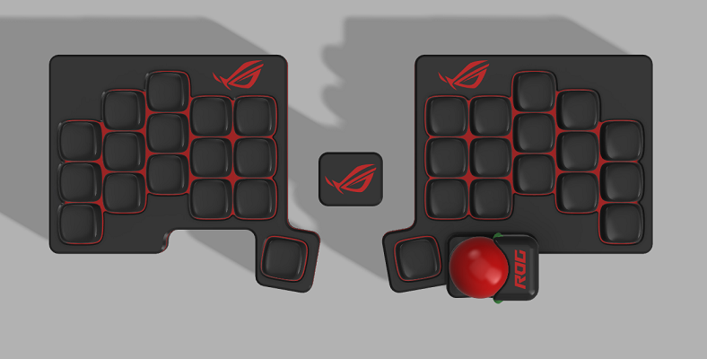
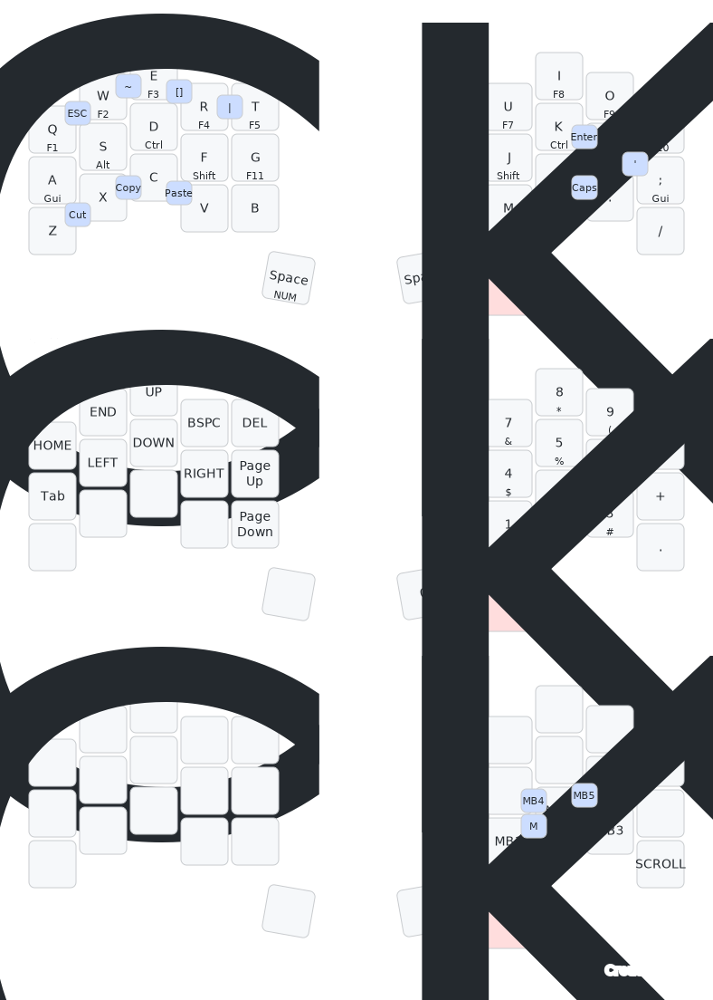
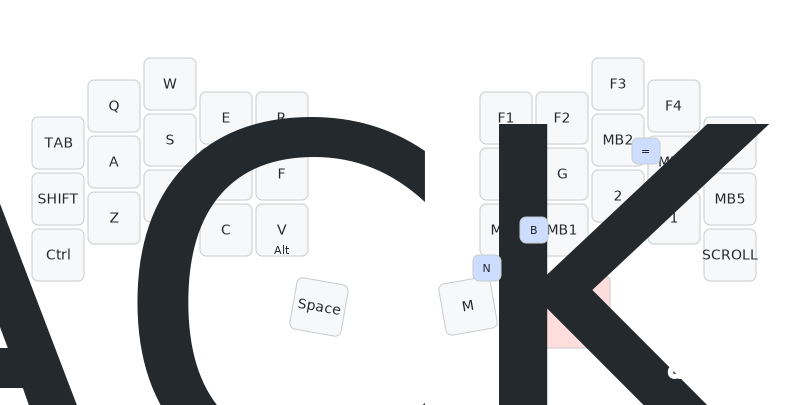
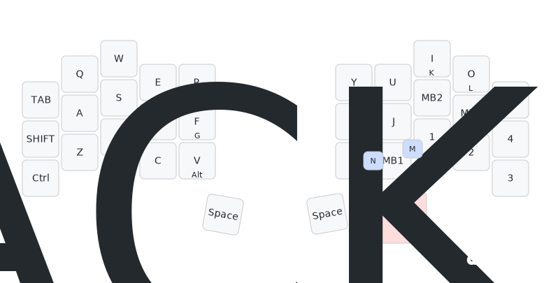

# keymap

키맵을 압축하여 두 개의 레이어를 사용합니다.

모디키는 홈로우 모드, 펑션키는 홀드탭으로 대체하였고 네비키를 좌측, 숫자키를 우측에 배치하였습니다.

CAD 작업을 해서 숫자키를 많이 사용합니다.

Y, P, N 자리는 누르기가 불편해서 사용하지 않고 곱하기는 NUM+Shift+8을 조합해서 사용하고 나누기는 default 레이어의 /를 사용합니다.

특수문자도 마찬가지로 NUM+Shift+숫자를 조합해 입력합니다.

한/영과 캡스락은 콤보에 탭댄스 사용하여 한 번 누르면 한/영 두 번 누르면 캡스락이 입력됩니다.

오토 마우스 레이어를 사용하여 트랙볼의 움직임을 감지하여 마우스 레이어로 전환하고

일정 시간이 지나거나 마우스 키를 제외한 키를 입력하여 기본 레이어로 돌아갑니다.

Use two layers by compressing the keymap.

The modi key was replaced with the home row mode, the function key with the hold tab, and the nav key was placed on the left and the number key was placed on the right.

I do CAD work, so I use a lot of numeric keys.

Y, P, and N digits are uncomfortable to press, so do not use, but use a combination of NUM+Shift+8 for multiplication, and / in the default layer for division.

For special characters, enter a combination of NUM+Shift+ numbers.

Using the auto mouse layer, it detects the movement of the trackball and switches to the mouse layer

Return to the default layer after a certain period of time or by entering keys other than the mouse key.

# PUBG: Battlegrounds

# Path of Exile 2

